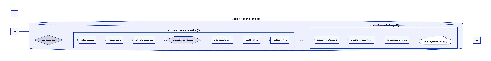

# 🚀 My DevOps Node.js App

[](https://github.com/ArtemRivnyi/my-devops-node-app/actions/workflows/docker-build.yml)
[](https://nodejs.org/)
[](https://expressjs.com/)
[](https://www.docker.com/)
[](https://docs.microsoft.com/en-us/powershell/)
[](https://github.com/ArtemRivnyi/my-devops-node-app/actions/workflows/docker-build.yml)
[](https://opensource.org/licenses/MIT)
[](https://github.com/ArtemRivnyi/my-devops-node-app/commits/main )
[](https://github.com/ArtemRivnyi/my-devops-node-app/stargazers )

### 🧩 DevOps Demo Project: Containerized Web Application with Local CI/CD

This project serves as a practical demonstration of core DevOps skills, covering web application development, containerization, and local CI/CD automation. It aims to provide a comprehensive example for building, testing, and deploying a simple Node.js web application.

## 📝 Table of Contents

*   [🎯 Project Goals](#-project-goals)
*   [🧠 Technologies and Practices Used](#-technologies-and-practices-used)
*   [⚙️ Running the Application Locally (with Local CI/CD)](#️-running-the-application-locally-with-local-cicd)
*   [🛠️ CI/CD Flow and Demo](#️-ci/cd-flow-and-demo)
    *   [Clone the Repository](#clone-the-repository)
    *   [Ensure Docker Desktop is running](#ensure-docker-desktop-is-running)
    *   [Run the local CI/CD pipeline](#run-the-local-cicd-pipeline)
    *   [Access the running app](#access-the-running-app)
*   [📊 Monitoring and Logging (Locally)](#-monitoring-and-logging-locally)
*   [🧹 Managing the Local Container](#-managing-the-local-container)
*   [☁️ Conceptual Cloud Deployment (No Cost Setup)](#%EF%B8%8F-conceptual-cloud-deployment-no-cost-setup)
*   [🧭 Next Steps for Project Development](#-next-steps-for-project-development)
*   [🏁 Summary](#-summary)
*   [📄 License](#-license)
*   [💡 Maintainer](#-maintainer)

## 🎯 Project Goals

*   🖥️ Develop a simple web application using **Node.js** and **Express.js**
*   🐳 Containerize the app using **Docker** for portability and isolation
*   ⚙️ Set up an automated **local CI/CD pipeline** (build, test, run)
*   ☁️ Demonstrate understanding of **cloud deployment & monitoring principles**

## 🧠 Technologies and Practices Used

| Tool / Concept | Purpose |
| :-- | :-- |
| **Node.js & Express.js** | Lightweight web server development |
| **HTML & CSS** | User interface for static pages |
| **Docker** | Containerization and image management |
| **PowerShell** | Local CI/CD automation (build & run) |
| **Git & GitHub** | Version control and remote repository |
| **morgan** | Request logging middleware for Node.js |
| **Mocha & Chai** _(optional)_ | Testing and assertions framework |

## ⚙️ Running the Application Locally (with Local CI/CD)

This pipeline automates the **building of a Docker image** and **running a container** locally.

### Clone the repository

```shell
git clone https://github.com/YOUR_USERNAME/my-devops-node-app.git
cd my-devops-node-app
```

> 🔁 Replace `YOUR_USERNAME` with your actual GitHub username.

### Ensure Docker Desktop is running

You must have Docker installed and running before executing the script.

### Run the local CI/CD pipeline

For detailed setup and troubleshooting, see the dedicated [SETUP.md](SETUP.md) file.

Open **PowerShell (not as Administrator)** and run:

```shell
.\deploy_local.ps1
```

### Access the running app

After successful deployment, open:  
👉 [http://localhost:3000/]()

## 🛠️ CI/CD Flow and Demo

### Architecture Diagram (CI/CD Flow)

The project utilizes GitHub Actions for Continuous Integration and Continuous Delivery. The flow is as follows:



## 📊 Monitoring and Logging (Locally)

To view container logs in real-time:

```shell
docker logs my-node-app-container -f
```

These logs display:

*   Request information (via `morgan`)
*   Form submission data
*   Any `console.log()` output

## 🧹 Managing the Local Container

Stop the container:

```shell
docker stop my-node-app-container
```

Remove the container:

```shell
docker rm my-node-app-container
```

Remove the Docker image:

```shell
docker rmi my-node-webapp-local
```

## ☁️ Conceptual Cloud Deployment (No Cost Setup)

While this demo runs locally, it includes a **conceptual outline for cloud deployment** (e.g., Google Cloud Platform).

### 🔧 Cloud Platform Preparation (GCP Example)

1.  Create/select a GCP project
2.  Enable APIs:
    *   Cloud Run API
    *   Artifact Registry API
3.  Create a **Service Account** with roles:
    *   _Cloud Run Admin_
    *   _Artifact Registry Writer_
    *   _Service Account User_
4.  Create a **Docker repository** in Artifact Registry

### 🚀 Service Provisioning (Cloud Run Example)

*   Deploy the Docker image from Artifact Registry
*   Configure environment variables, memory/CPU limits
*   Cloud Run auto-scales and provides a public URL

### 📈 Cloud Monitoring & Logging

*   Logs (`stdout` / `stderr`) automatically captured by **Cloud Logging**
*   Metrics (CPU, memory, latency) visualized in **Cloud Monitoring**

## 🧭 Next Steps for Project Development

✅ Add **unit/integration tests** using Mocha & Chai  
✅ Integrate **Docker Compose** into the pipeline  
✅ Extend **CI/CD to the Cloud** via GitHub Actions  
✅ Configure **real-time monitoring** (Cloud Logging / AWS CloudWatch)

## 🏁 Summary

This project demonstrates how to:

*   Build and containerize a Node.js app
*   Automate local deployment via PowerShell
*   Simulate DevOps CI/CD workflows
*   Prepare for real-world cloud deployment

## 📄 License

This project is licensed under the MIT License - see the [LICENSE](LICENSE) file for details.

## 🧰 Maintainer

**Artem Rivnyi** — Junior Technical Support / DevOps Enthusiast

* 📧 [artemrivnyi@outlook.com](mailto:artemrivnyi@outlook.com)  
* 🔗 [LinkedIn](https://www.linkedin.com/in/artem-rivnyi/)  
* 🌐 [Personal Projects](https://personal-page-devops.onrender.com/)  
* 💻 [GitHub](https://github.com/ArtemRivnyi)
